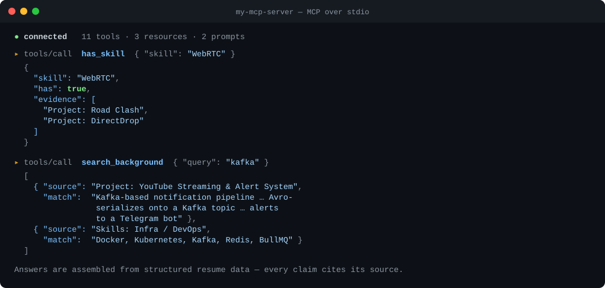

# my-mcp-server

[](https://github.com/jason-bourne-gg/my-mcp-server/actions/workflows/ci.yml)

An [MCP](https://modelcontextprotocol.io) server that exposes **Aniket Charjan's
resume as a queryable API for AI assistants**. Add it to Claude Desktop, Cursor,
or any MCP client and ask *"What did Aniket do at BrowserStack?"* or *"Has he
shipped anything with WebRTC?"* — answered from structured, sourced data instead
of guesswork.



*Real output from the server — `has_skill` returns evidence rather than a yes/no,
and `search_background` cites the project or skill group each match came from.*

It implements all three MCP primitives — **Tools**, **Resources**, and
**Prompts** — so it works as a complete reference server, not just a tool dump.

## Tools

| Tool | Returns |
| --- | --- |
| `get_profile` | Name, current role, location, summary, links |
| `get_experience` | Full work history with highlights and per-role stack |
| `get_projects` | All side projects |
| `get_project(name)` | One project by name (partial match) |
| `get_skills` | Skills grouped by category |
| `has_skill(skill)` | Whether he has a skill **+ supporting evidence** |
| `get_highlights` | Headline career metrics |
| `get_education` | Education history |
| `get_contact` | Contact details and availability |
| `get_resume` | The entire resume as one Markdown document |
| `search_background(query)` | Free-text AND-search across experience, projects, skills |

## Resources

| URI | Content |
| --- | --- |
| `resume://full` | The full resume as Markdown |
| `resume://profile` | Profile summary as JSON |
| `resume://all` | All structured data as JSON |

## Prompts

| Prompt | Purpose |
| --- | --- |
| `screen_for_role(job_description)` | Score Aniket's fit for a role, citing evidence |
| `draft_outreach(company, role?)` | Draft a tailored recruiter outreach message |

## Use it

```bash
git clone https://github.com/jason-bourne-gg/my-mcp-server.git
cd my-mcp-server
npm install && npm run build
```

### Claude Desktop

Add to `claude_desktop_config.json` (Settings → Developer → Edit Config), using
the absolute path to the built file:

```json
{
  "mcpServers": {
    "aniket": {
      "command": "node",
      "args": ["/absolute/path/to/my-mcp-server/dist/index.js"]
    }
  }
}
```

Restart Claude Desktop, then ask: *"Using the aniket tools, what's his experience with LLMs?"*

### Cursor

Add the same block to `~/.cursor/mcp.json` (or Settings → MCP). The bare name `my-mcp-server` is already taken on npm by an unrelated package,
so if this is ever published it will be scoped as `@jason-bourne-gg/my-mcp-server`
(`npx -y @jason-bourne-gg/my-mcp-server`). Until then, use the local path above.

## Develop

```bash
npm install
npm run build     # tsc → dist/
npm start         # run the built server on stdio
```

Smoke-test over stdio without a client:

```bash
printf '%s\n' \
  '{"jsonrpc":"2.0","id":1,"method":"initialize","params":{"protocolVersion":"2024-11-05","capabilities":{},"clientInfo":{"name":"t","version":"1"}}}' \
  '{"jsonrpc":"2.0","method":"notifications/initialized"}' \
  '{"jsonrpc":"2.0","id":2,"method":"tools/list","params":{}}' \
  '{"jsonrpc":"2.0","id":3,"method":"resources/list","params":{}}' \
  '{"jsonrpc":"2.0","id":4,"method":"prompts/list","params":{}}' \
  | node dist/index.js
```

All content lives in `src/data.ts` — edit there and rebuild.

## How it works

A stdio MCP server built on
[`@modelcontextprotocol/sdk`](https://github.com/modelcontextprotocol/typescript-sdk).
It registers the `tools`, `resources`, and `prompts` capabilities and handles the
corresponding `list` / `call` / `read` / `get` requests. `search_background` and
`has_skill` run over a flattened index of every experience highlight, project, and
skill, returning each hit with its source. Tool handling is wrapped so a single
bad request can never crash the server, and `SIGINT`/`SIGTERM` shut it down
cleanly.

## License

[MIT](LICENSE) © Aniket Ravindra Charjan
